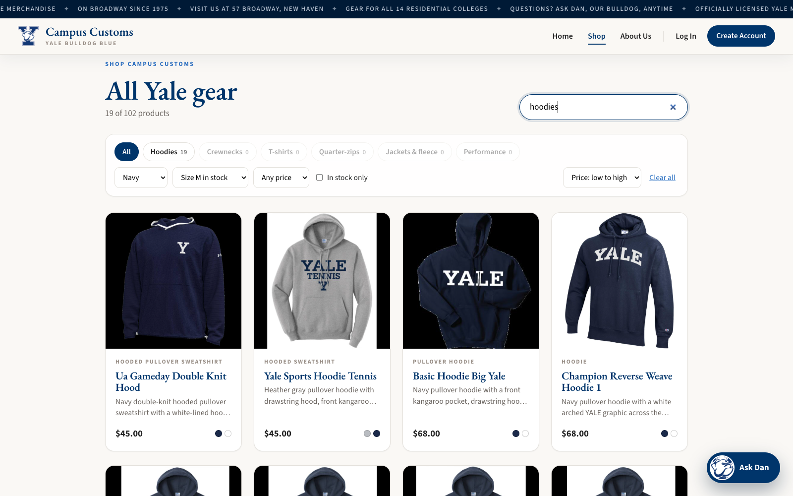
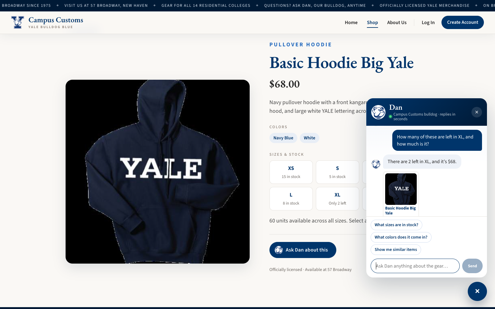

# Campus Customs — Usability Improvements (Problem 9)

## How the review was done

I reviewed the whole running app (React frontend, FastAPI backend, and the PydanticAI agent) as a shopper would use it, and I measured it before changing anything.

- **Agent benchmark:** a development benchmark script (kept out of the submitted repo so it matches the required layout) ran 10 representative shopper questions through the real agent twice each (20 turns), against a copy of the database. It recorded, per question, latency, model round trips, tool calls, input/cached/output tokens, validator retries, unwanted page takeovers, and a pass/fail correctness check. Portkey's response cache is bypassed (`PORTKEY_FORCE_REFRESH=1`) so every timing is a real model call. The results are summarised in the tables below.
- **Products-page search audit:** 20 common shopper searches were run through the page's search logic, and I counted how many return nothing.
- **Hands-on walkthrough:** I browsed Home → Products → a product page, used the chat as a guest and while logged in, and noted every point of friction.

### What the review found

| # | Finding | Evidence |
|---|---|---|
| 1 | The Products-page search only matches the exact text typed, so plurals and two-word searches find nothing | **9 of 19** searches that should match something returned **0 results**: "hoodies", "crewnecks", "t-shirts", "tees", "quarter zip", "1/4 zip", "navy hoodie", "berkeley college", "sweatshirts". There were also no filters or sorting, so "navy crewnecks under $60 in M" meant scrolling through 102 cards. |
| 2 | The chat opens to an empty text box, so shoppers must think up and type every question, even on a product page where the obvious questions ("is this in my size?", "what colors?") are predictable | The average benchmark question is 43 characters to type. The widget had no suggested questions on any page. |
| 3 | Every answer costs several model round trips, even when the answer is already known | **2.65 model requests** and **5.83 s** per reply on average. "How much is the Basic Hoodie Big Yale?" took 3 requests (search → price → answer), and "Do you have this in L?" on that product's own page took 2–3. |
| 4 | The chat sometimes takes over the Products page when it shouldn't, and drifts off-topic | "Do you have this in pink?" (on a product page) and even "Can you write my econ essay?" called `show_products_on_page`, pulling the shopper off their page, once to an empty result set. The essay reply offered to "build an outline", which is off-topic for a shop assistant. |

## The four improvements

| # | Improvement | Type | Helps |
|---|---|---|---|
| 1 | Smart search, filters, and sorting on the Products page | Frontend | Shoppers find items; the business turns more visits into product views |
| 2 | Context-aware suggestion chips in the chat | Frontend | Shoppers ask in one click; more chat engagement |
| 3 | Fewer model round trips: product-page facts sent with the question, and search results treated as authoritative | Agent / backend | Faster replies for shoppers; lower model cost per chat |
| 4 | Page takeovers only for real browsing with results, and stricter on-topic replies | Agent / backend | Shoppers don't lose their place; the brand stays focused |

Each section below says what was added, why it helps, and the before/after numbers.

---

## 1. Smart search, filters, and sorting on the Products page (frontend)

### What was added

- **Smarter search** ([`frontend/src/search.ts`](../frontend/src/search.ts)):
  - It matches whole words, so every word you type must appear, instead of the whole phrase as one exact string.
  - Plurals are folded ("hoodies" → hoodie).
  - Common spellings are treated as one: "tees", "t-shirts", and "t shirt" all mean the same thing, as do "quarter zip", "1/4 zip", and "1 4 Zip"; "hooded" and "hoodies"; and "crew neck" and "crewneck".
  - Partial words match ("berk" finds Berkeley), and filler words like "the" or "college" are ignored.
  - It searches the name, type, description, colors, **and the catalogue's search tags** (so "rivalry" or "gift" work).
  - Results where the words appear in the name rank first.
- **Category chips with live counts:** All, Hoodies, Crewnecks, T-shirts, Quarter-zips, Jackets & fleece, Performance. The counts update as other filters change, and empty categories are greyed out.
- **Filters:**
  - Color family: Navy, Blue, Gray, Black, White, Red, Green.
  - **Size in stock:** only items you can actually buy in your size. Before, this was only visible after opening each product.
  - Price (under $40, $60, or $80) and an in-stock-only toggle.
- **Sorting:** best match, price low→high, price high→low, name A–Z.
- **A result count** ("19 of 102 products"), a **Clear all** link, and a helpful empty state that points to the chat assistant.
- **Filters are kept in the URL** (`/products?q=hoodies&color=Navy&size=M`), so Back from a product page, reloading, and sharing a link all keep the shopper's filters. Pressing **`/`** jumps to the search box.

It all runs in the browser on the 102 products that are already loaded, so filtering is instant, with no extra server calls.

### Why it helps

- **Shopper:** the most common searches no longer hit a dead end. "What can I buy in my size?" is a single dropdown instead of opening product pages one by one. Budget shoppers can sort by price.
- **Business:** every search that returns nothing is a likely lost sale. Size-aware filtering sends shoppers straight to items that can actually be sold in their size, rather than to sold-out ones.

### Results (measured on the live catalogue of 102 products)

**Search audit, 20 common searches:**

| Metric | Before | After |
|---|---|---|
| Searches returning **0 results** that should have matches | **9 of 19 (47%)** | **0 of 19 (0%)** |
| "hoodies" / "crewnecks" / "t-shirts" / "tees" | 0 / 0 / 0 / 0 | 27 / 39 / 25 / 25 |
| "quarter zip" / "1/4 zip" / "navy hoodie" / "berkeley college" / "sweatshirts" | 0 / 0 / 0 / 0 / 0 | 12 / 12 / 25 / 2 / 59 |
| "pink" (nothing is pink) | 0 | 0 (correct), with an empty state that points to Clear all and the chat |

**Shopper tasks:**

| Task | Before | After |
|---|---|---|
| Find hoodies by typing "hoodies" | **0 results**, a dead end; you had to know to type the singular | 27 results, 0 extra steps |
| Navy hoodie in size **M** | Search "hoodie" → 26 cards → **open up to 26 product pages** to check size M (18 qualify) | Hoodies chip + Navy + Size M = **3 clicks, 0 product pages opened**, 19 results all buyable in M |
| Crewnecks under $60, cheapest first | Not possible: no sort or price filter, so you compare 29 prices by eye | Crewnecks chip + Under $60 + sort by price = **3 clicks** |
| Berkeley College gear | "berkeley college" → **0 results** | 2 results |
| Quarter-zips in stock in XL | "quarter zip" → **0 results**, and size was only visible on product pages | Quarter-zips chip + Size XL = **2 clicks**, 9 results |
| Keep filters after viewing a product | Filters lost on Back | Kept (in the URL) |

---

## 2. Context-aware suggestion chips in the chat (frontend)

### What was added

Up to three one-tap **suggested questions** now sit above the chat input ([`frontend/src/suggestions.ts`](../frontend/src/suggestions.ts)). They are built from what's on screen, so they are always relevant:

| Where the shopper is | Chips |
|---|---|
| **Product page** | "What sizes are in stock?" (becomes "**Is this in stock in XL?**" once a size is selected), "What colors does it come in?", "Show me similar items" |
| Home, About, and other pages | "What hoodies do you have?", "Gear for my residential college", "Gifts under $40", plus "What was I looking at last time?" for a logged-in shopper with saved history |
| After the chat put results on the Products page | "Only ones in stock in M", "Under $60", "Just the navy ones" (refinements) |
| After a reply with product cards | "What sizes does the *[first product]* come in?", "Show me similar items", "Anything cheaper?" |

- Clicking a chip sends the question immediately, with the full page context from Problem 8, so "this" resolves to the on-screen product.
- A chip disappears once its question has been asked, and chips hide while the assistant is thinking.
- The chips are generated in the browser from the page state, so they cost **no model call**.

### Why it helps

- **Shopper:** the empty-box "what do I even ask?" moment is gone. On a product page, the three questions shoppers most often need answered are one tap away. The size-aware chip ("Is this in stock in XL?") uses the size they just selected, so they don't have to retype it. This matters most on phones, where typing is slow.
- **Business:** suggestions steer shoppers toward what the assistant does best and cheapest (stock, sizes, similar items) and away from off-topic requests. Every chip is also a nudge toward a product page or a size check, which is the step before a purchase.

### Results

| Metric | Before | After |
|---|---|---|
| Actions to ask a common question | Type about **24 characters** (average over the 14 chip questions) + Enter | **1 click** |
| Time to ask, at average typing speed (40 wpm desktop / about 25 wpm phone) | **7.2 s / 11.6 s** | under 1 s |
| Product-page questions that need retyping the item or size | All of them (or trusting "this" works) | 0: the chips carry the page and the selected size |
| **Reply time for a repeated opening question** (live app, 3 tries each) | A typed variant ("what hoodies do u have"): **3.2 s** on each new phrasing | Chip text is identical every time, so Portkey's response cache answers it: **2.3 s → 0.31 s → 0.30 s** ("What hoodies do you have?"), **2.9 s → 0.23 s** ("What colors does it come in?") |
| Extra model calls to generate suggestions | none | none (built in the browser) |

The last row is a side benefit I observed while testing on the live app. Because chip questions are exactly the same text every time, they hit the model-response cache after the first ask, and the reply comes back **about 10× faster**. That is also a cache hit instead of a paid model call. The cached answers stay correct: the cache key includes the tool results and the on-screen stock snapshot, so a stock change produces a fresh answer.

Tested in the running app:
- On the Basic Hoodie page the chips were "What sizes are in stock? / What colors does it come in? / Show me similar items".
- Selecting **XL** changed the first chip to "Is this in stock in XL?". Clicking it replied "Yes, it's in stock in XL, with 2 left", and that chip disappeared.
- On Home, clicking "What hoodies do you have?" switched the Products page to the 27 hoodies and offered the three refinement chips.

---

## 3. Fewer, cheaper model round trips (agent / backend)

### What was added

1. **On-screen product facts are sent with the question.** On a product page, the server reads the item's price, colors, full description, and stock for every size from the database *for that message*. It adds them to the agent's context, and the Problem 6 number check treats them as looked up. Questions about "this" no longer need a search first.
2. **Search results are complete.** `search_products` results now include `stock_by_size` and a `short_description`, and the prompt says not to follow a search with a separate price or stock lookup for the same item. "How much is X?" and "what does X look like, how much, and what sizes?" become one lookup instead of two to four.
3. **Parallel lookups:** the prompt asks for independent lookups (for example, the two items in a comparison) in a single step.
4. **Fixed a false positive in the Problem 6 price check.** The shopper's own budget ("under **$60**") was flagged as a made-up price, so the agent was sent back to redo work. That cost 1–4 wasted model round trips on every budget question. The shopper's amounts and budget filters now count as allowed.
5. **Cache-friendly prompt order:** the ~2,500-token static prompt is now sent first on every request, with the per-message context after it. The provider's prompt cache can reuse the long unchanging prefix instead of seeing a different prompt start every time (see §4 for the bug this also fixed).
6. **One automatic retry on a dropped connection.** During benchmarking, 4 of about 150 requests failed with a transient TLS error that a shopper would have seen as an error bubble. `run_chat` now retries these once.

### Why it helps

- **Shopper:** answers arrive faster, and the slowest ones improved most. Budget questions ("navy crewnecks under $60") were the worst case at 8.6 s and are now 3.3 s.
- **Business:** each model round trip is paid for. Fewer round trips, fewer output tokens, and more cached input mean a lower cost per conversation at the same or better quality (§4).

### Results

Benchmark: 11 questions × 3 runs = 33 real model turns before and after, cache bypassed.

| Metric (per reply) | Before | After | Change |
|---|---|---|---|
| Mean response time | 5.20 s | **4.22 s** | **−19%** |
| Slowest 10% (p90) | 7.15 s | **4.95 s** | **−31%** |
| Model round trips | 2.52 | **2.00** | **−21%** |
| Tool calls | 1.82 | **1.06** | **−42%** |
| Validator retries (wasted round trips) | 3 | **0** | −100% |
| Output tokens | 169.6 | **128.5** | −24% |
| Estimated cost index* | 2,210 | **1,963** | **−11%** |

\*Cost index = uncached input tokens + 0.1 × cached input tokens + 4 × output tokens, which is the usual price ratio for cached vs. uncached input and output tokens. It compares relative cost; it isn't a dollar amount.

Per question (round trips; seconds):

| Question | Round trips | Seconds |
|---|---|---|
| How much is the Basic Hoodie Big Yale? | 3.0 → **2.0** | 6.5 → **3.1** |
| Do you have this in pink? (product page) | 3.0 → **2.0** | 6.0 → **3.4** |
| Davenport crewneck: look, price, and sizes | 3.0 → **2.0** | 5.9 → **3.6** |
| Show me navy crewnecks under $60 | 3.7 → **2.0** | 8.6 → **3.3** |
| Compare two full-zip hoodies | 3.0 → **2.0** | 6.4 → **4.5** |
| Other 6 questions (already at the 2-step minimum: one lookup + answer) | 2.0 → 2.0 | within ±0.7 s (run-to-run noise) |

Every question now takes the minimum of two steps: one lookup, then the answer. On product pages the model still does one confirming lookup even though the snapshot already has the facts, so those questions stayed at 2 steps rather than dropping to 1. The snapshot still guarantees that "this" always resolves to the right item.

---

## 4. Better answers: prompt on every turn, page takeovers only when wanted, strict on-topic (agent / backend)

### What was added

1. **A significant bug found and fixed: the system prompt was missing on every follow-up turn.** PydanticAI only sends `system_prompt` when a request has **no** message history. Every logged-in shopper (history reloaded from the database) and every guest after their first message was therefore answered **without the Campus Customs prompt**: no voice, no plain-text rule, no grounding rules, no safety rules. I confirmed this with a stub model. The prompt now goes in as `instructions=`, which are sent on every request.
2. **Page takeovers only when they help:**
   - `show_products_on_page` no longer changes the page when nothing matched (it used to show a "No matches" page) or when no keyword or filter was given (the whole catalogue, which the Products page already shows). This was how off-topic requests used to pull the shopper away.
   - The agent's structured answer has a new **`update_page`** field. The website switches the Products page only when it is `true`, meaning the reply actually introduces browse results. The agent confirms at the end instead of deciding mid-search.
   - The prompt lists when *never* to change the page: questions about the on-screen product, declines, off-topic requests, and "how much is the cheapest one?" about items already shown.
3. **Stricter on-topic and format rules:** decline off-topic requests in one sentence, with a worked example, and don't offer "help with the topic" or call tools. Use plain text even when the shopper asks for a table, since the chat widget can't display one.

### Why it helps

- **Shopper:** follow-up questions now get the same careful, on-brand, safe answers as the first one. Asking about a product no longer pulls you off its page to an empty or unrelated results page.
- **Business:** before this fix, the safety and brand rules effectively applied only to the first message of each chat. Off-topic work (essays, poems) costs money and dilutes the brand. Page hijacks interrupt shoppers who are one step from buying.

### Results

**Single-question suite** (33 turns; same files as §3):

| Metric | Before | After |
|---|---|---|
| Correct answers | 93.9% | **100%** |
| Correct page decisions (changed only when it should) | 90.9% | **100%** |
| Unwanted page takeovers | **3** | **0** |
| "Can you write my econ essay?" handled correctly | 0 / 3 (page hijacked each time; offered to "build an outline") | **3 / 3** ("That's outside what I can help with here, but I'd be glad to help you find some Yale gear…") |

**Follow-up suite:** turn-2 questions after "What hoodies do you have?", 5 questions × 3 runs = 15 turns.

| Metric | Before | After |
|---|---|---|
| Correct answers | **60%** | **100%** |
| "…Put it in a markdown table" → plain text | 0 / 3 (markdown tables) | **3 / 3** |
| "Can you also write me a short poem about economics?" → declined | 0 / 3 (**wrote the poem**) | **3 / 3** |
| "How much is the cheapest one?" (page left alone) | 1 / 3 | **3 / 3** |
| Unwanted page takeovers | 2 | **0** |
| Prompt tokens reaching the model | only the short per-message context (about 2.3k total input) | full prompt (about 8.5k total input, 88% cached) |
| Mean response time | 8.17 s | **4.43 s (−46%)** |
| Slowest 10% (p90) | 12.63 s | **5.03 s (−60%)** |
| Estimated cost index | 3,558 | **2,432 (−32%)** |

Follow-ups also got **faster and cheaper** even though the model now reads about 6k more tokens per request. The full prompt is identical on every request, so it is served from the provider's prompt cache (88% of input tokens cached, versus 13% before). With the rules in place the model also takes more direct paths.

---

## Summary

| # | Improvement | Headline result |
|---|---|---|
| 1 | Smart search + filters + sort (frontend) | Common searches returning nothing: **47% → 0%**. "Navy hoodie in size M": up to **26 product pages opened → 3 clicks** |
| 2 | Context-aware chat chips (frontend) | Asking a common question: **about 24 characters typed (7–12 s) → 1 click**. Repeated chip questions answered from cache: **2.3 s → 0.3 s** |
| 3 | Fewer round trips (backend) | Mean reply **5.20 → 4.22 s (−19%)**, p90 **−31%**, round trips **−21%**, tool calls **−42%**, cost index **−11%** |
| 4 | Prompt on every turn + page/on-topic guards (backend) | Follow-up correctness **60% → 100%**, single-question correctness **93.9% → 100%**, unwanted page takeovers **5 → 0**, follow-up reply time **−46%** |

### How the numbers were measured

- **Agent numbers (§3–4):** a development benchmark ran against a *copy* of the database with Portkey's response cache bypassed (`PORTKEY_FORCE_REFRESH=1`), so every call was a real model call. The "before" runs used the code as it was at the start of Problem 9. An intermediate run, after the round-trip changes but before the prompt-order fix, showed the cached share *falling* from 93% to 85% and the cost index *rising* to 2,703. That is what led to finding the missing-prompt bug. The script and its raw JSON results were kept out of the submitted repo so it matches the required layout.
- **Search audit and task numbers (§1):** these came from running `frontend/src/search.ts` directly with Node against the live `/api/products` data.
- **Screenshots:** from the running app. See also [`app_check.html`](app_check.html), check 3.
